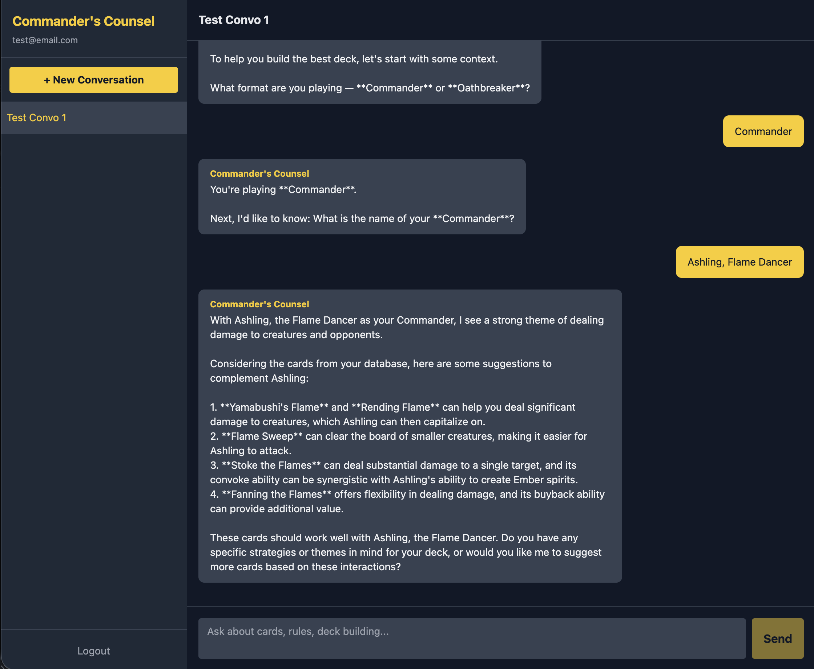

# Commander's Counsel 🧙‍♂️

An AI-powered Magic: The Gathering deck building and rules assistant, specializing in Commander and Oathbreaker formats.

Built with a FastAPI backend, React + TypeScript frontend, PostgreSQL database, and RAG (Retrieval Augmented Generation) powered by a local Scryfall card database.



---

## Features

- 🃏 **37,000+ card database** sourced from Scryfall's bulk data API
- 🤖 **AI assistant** powered by Groq (Llama 3.3 70B) with streaming responses
- 🔍 **RAG pipeline** — answers grounded in real card data, not hallucinations
- 🧭 **Guided onboarding** — bot establishes deck context before making recommendations
- 🔐 **JWT authentication** with httpOnly cookies
- 💬 **Persistent conversations** with editable names and delete support
- ⚡ **Streaming responses** for a live, responsive chat experience

---

## Tech Stack

| Layer | Technology |
|---|---|
| Frontend | React, TypeScript, Tailwind CSS, Vite |
| Backend | FastAPI, Python, SQLAlchemy (async) |
| Database | PostgreSQL |
| AI | Groq API (Llama 3.3 70B) |
| Card Data | Scryfall Bulk Data API |
| Auth | JWT + bcrypt |
| Migrations | Alembic |
| Deployment | Docker Compose |

---

## Architecture
React/TS Frontend (Vite)
↕
FastAPI Backend
↕                    ↕
Groq API            PostgreSQL
(cards + users + conversations + messages)

**RAG Flow:**
1. User sends a message
2. Backend parses intent (colors, card types, keywords)
3. Queries local card database for relevant cards
4. Injects real card data into the LLM prompt
5. Streams grounded response back to the frontend

---

## Getting Started

### Prerequisites
- Python 3.11+
- Node.js 20+
- Docker Desktop

### 1. Clone the repo
```bash
git clone https://github.com/yourusername/commanders-counsel.git
cd commanders-counsel
```

### 2. Backend setup
```bash
cd backend
python -m venv venv
source venv/bin/activate  # Windows: venv\Scripts\activate
pip install -r requirements.txt
```

### 3. Environment variables
```bash
cp .env.example .env
# Fill in your values:
# SECRET_KEY — generate with: python -c "import secrets; print(secrets.token_hex(32))"
# GROQ_API_KEY — get free at https://console.groq.com
```

### 4. Start the database
```bash
docker start commanders-counsel-db
# Or with Docker Compose:
docker-compose up db
```

### 5. Run migrations
```bash
alembic upgrade head
```

### 6. Ingest card data
```bash
python ingest.py
# Downloads and loads 37,000+ cards from Scryfall (~2-3 minutes)
```

### 7. Start the backend
```bash
uvicorn app.main:app --reload
```

### 8. Start the frontend
```bash
cd ../frontend
npm install
npm run dev
```

### 9. Open the app
Visit **http://localhost:5173**

---

## Project Structure
commanders-counsel/
├── backend/
│   ├── app/
│   │   ├── core/          # Config, constants, rate limiting
│   │   ├── db/            # Database connection and session
│   │   ├── models/        # SQLAlchemy models
│   │   ├── routers/       # FastAPI route handlers
│   │   ├── schemas/       # Pydantic request/response schemas
│   │   └── services/      # Business logic (RAG, chat, Scryfall)
│   ├── alembic/           # Database migrations
│   ├── ingest.py          # Scryfall data ingestion script
│   └── requirements.txt
├── frontend/
│   └── src/
│       ├── api/           # Axios configuration
│       ├── components/    # React components
│       ├── context/       # Auth context
│       ├── pages/         # Page components
│       └── types/         # TypeScript interfaces
├── docker-compose.yml
└── README.md

---

## Key Design Decisions

**Why RAG over pure LLM?**
Magic cards are highly specific — mana costs, oracle text, and legality must be exact. RAG grounds the AI's responses in real card data from your local database, preventing hallucination on card details.

**Why PostgreSQL over MongoDB?**
The data has a natural relational structure: users → conversations → messages, and cards with structured fields. SQL queries also make card filtering (by color, type, legality) clean and efficient.

**Why Groq over OpenAI/Anthropic?**
Groq's free tier provides fast inference on Llama 3.3 70B — ideal for a portfolio project. The architecture is provider-agnostic and can be swapped to any OpenAI-compatible API.

**Why httpOnly cookies over localStorage for JWT?**
localStorage is vulnerable to XSS attacks. httpOnly cookies are inaccessible to JavaScript, making token theft significantly harder.

---

## Future Improvements

- [ ] Weekly automated card database updates via APScheduler
- [ ] Card price tracking (Scryfall pricing data)
- [ ] Deck list import/export
- [ ] Card image display in chat responses
- [ ] Semantic search with pgvector embeddings

---

## Acknowledgements

Card data provided by [Scryfall](https://scryfall.com) via their free bulk data API.

## Built With Help From

This project was built with guidance from [Claude](https://claude.ai) (Anthropic), 
which served as a coding coach and architecture advisor throughout development.
All code was written and understood by the developer.
